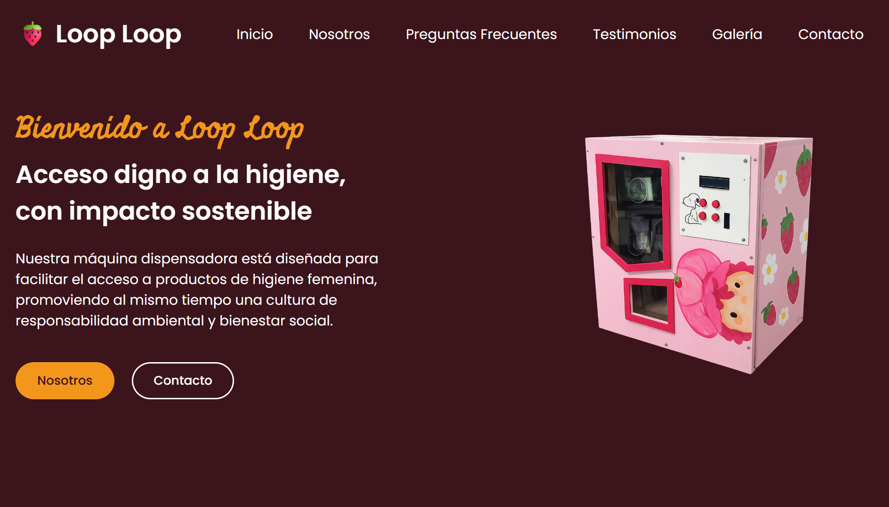

# 🍓 Loop Loop


Making hygiene products more accessible through a modern and responsive web experience.

## Mission

Loop Loop is a website project focused on promoting accessible hygiene solutions through technology, awareness, and community-centered innovation.

The project aims to provide a clean, intuitive, and engaging digital experience while showcasing the vision behind Loop Loop and its commitment to accessibility and sustainability.

## 🌐 Live Demo

👉 https://r-afikiii.github.io/loop-loop/

## 📸 Preview



## ✨ Features

- Responsive design across desktop, tablet, and mobile devices
- Modern and user-friendly interface
- Interactive navigation and dynamic elements
- Contact form for user communication
- Privacy Policy and Usage Policy pages
- Optimized for static deployment with GitHub Pages

## 🛠️ Built With

- HTML5
- CSS3
- Vanilla JavaScript

## 📁 Project Structure

```bash
loop-loop/
├── LICENSE
├── README.md
├── assets/
│   ├── icon.ico
│   └── looploop/
│       ├── box-hero-section.png
│       └── preview-1.png
├── css/
│   └── styles.css
├── html/
│   ├── index.html
│   ├── privacy.html
│   └── usage.html
└── js/
    └── scripts.js
```

## 🚀 Getting Started

### Clone the repository

```bash
git clone https://github.com/r-afikiii/loop-loop.git
```

### Navigate to the project folder

```bash
cd loop-loop
```

### Run locally

Open `html/index.html` in your preferred web browser.

## 📦 Deployment

This project is deployed using GitHub Pages and is publicly accessible through the live demo link above.

## 🗺️ Roadmap

- [ ] Improve form handling
- [ ] Add backend integration
- [ ] Expand project information pages
- [ ] Add multilingual support
- [ ] Enhance accessibility features
- [ ] Implement analytics and usage metrics

## 👨‍💻 Author

**rafikiii**

Creator and developer of Loop Loop.

## 📬 Contact

- GitHub: https://github.com/r-afikiii
- Instagram: https://www.instagram.com/rafax2bp/

## 📄 License

This project is licensed under the MIT License. See the `LICENSE` file for more information.

---

Thank you for visiting Loop Loop. Feedback, suggestions, and contributions are always welcome.
