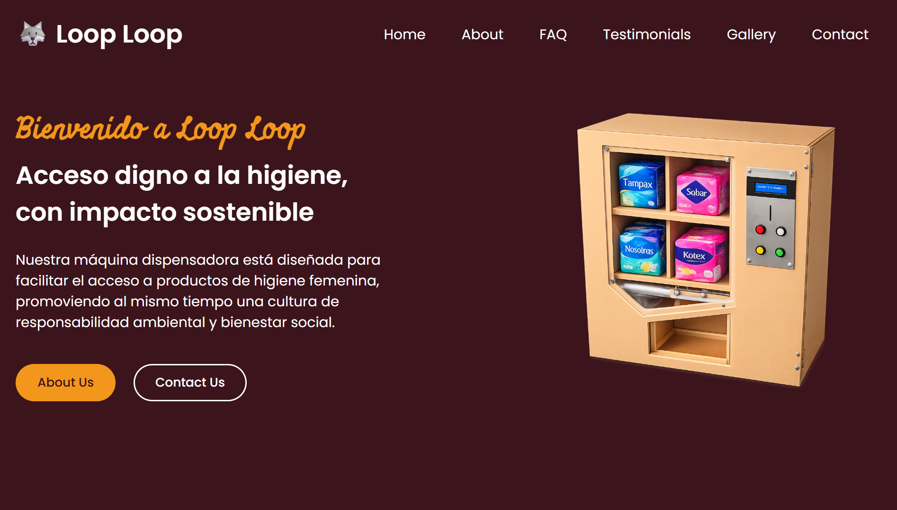

# 🐺 Loop Loop

A modern and responsive static website built using HTML, CSS, and JavaScript.

## 🚀 Live Demo

👉 https://r-afikiii.github.io/loop-loop/

## 📸 Preview



## 🛠️ Tech Stack

- HTML5
- CSS3
- JavaScript (Vanilla)

## 📁 Project Structure

```
loop-loop/
│
├── index.html
├── css/
│   └── styles.css
├── js/
│   └── scripts.js
└── assets/
    └── images/
```

## ✨ Features

- Responsive design
- Modern UI layout
- Image-based sections
- Interactive elements with JavaScript

## ⚙️ Setup & Usage

Clone the repository:

```
git clone https://github.com/r-afikiii/loop-loop.git
```

Open the project:

```
cd loop-loop
```

Run locally:

Just open `index.html` in your browser.

## 📦 Deployment

This project is deployed using GitHub Pages.

## 🧠 What I Learned

- Structuring a clean frontend project
- Working with Git and GitHub CLI
- Deploying a static website using GitHub Pages

## 📄 License

This project is open-source and available under the MIT License.
